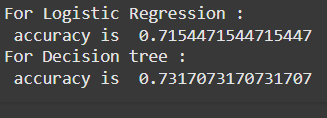

# Ex.No: 13 Learning – Use Supervised Learning  
### DATE:                                                                            
### REGISTER NUMBER : 212222040068
### AIM: 
To write a program to train the classifier for -----------------.
###  Algorithm:

### Program:
```
import numpy as np # linear algebra
import pandas as pd # data processing, CSV file I/O (e.g. pd.read_csv)
import matplotlib.pyplot as plt
import seaborn as sns
import warnings
warnings.filterwarnings('ignore')
import os
for dirname, _, filenames in os.walk('/kaggle/input'):
    for filename in filenames:
        print(os.path.join(dirname, filename))
df=pd.read_csv("/content/train_u6lujuX_CVtuZ9i.csv")
df.head()
df.shape
df.size
df.describe().T
df.isnull().sum()
df.fillna(method='ffill',inplace=True)
df.fillna(method='bfill',inplace=True)
df.isnull().sum()
plt.figure(figsize=(10,5))
sns.countplot(x='Gender',data=df,hue='Loan_Status',palette='Greens_d')
plt.show()
plt.figure(figsize=(5,5))
sns.countplot(x='Loan_Status',data=df,palette='deep')
plt.show()
plt.figure(figsize=(15,5))
sns.scatterplot(x="Loan_ID",y="LoanAmount",data=df)
plt.show()
plt.figure(figsize=(10,5))
sns.pairplot(df)
plt.show()
plt.figure(figsize=(10,5))
sns.boxplot(data=df)
plt.show()
df.drop('Dependents',axis=1,inplace=True)
df.drop('ApplicantIncome',axis=1,inplace=True)
df.drop('CoapplicantIncome',axis=1,inplace=True)
df.drop('LoanAmount',axis=1,inplace=True)
df.drop('Loan_Amount_Term',axis=1,inplace=True)
df.drop('Credit_History',axis=1,inplace=True)
df.head()
df=pd.get_dummies(df,columns=["Gender","Married","Education","Self_Employed","Property_Area","Loan_Status"])
df1.head()
df1.drop('Gender_Female',axis=1,inplace=True)
df1.drop('Married_No',axis=1,inplace=True)
df1.drop('Education_Graduate',axis=1,inplace=True)
df1.drop('Self_Employed_No',axis=1,inplace=True)
df1.drop('Property_Area_Rural',axis=1,inplace=True)
df1.drop('Loan_Status_N',axis=1,inplace=True)
df1.head()
X = df1[["Gender_Male","Married_Yes","Education_Not Graduate","Self_Employed_Yes","Property_Area_Semiurban","Property_Area_Urban"]].values
y=df1["Loan_Status_Y"].values
from sklearn.model_selection import train_test_split
xtrain,xtest,ytrain,ytest=train_test_split(X,y,test_size=0.2,random_state=0)

from sklearn.linear_model import LogisticRegression
m1=LogisticRegression()
m1.fit(xtrain,ytrain)
yp1=m1.predict(xtest)


from sklearn.tree import DecisionTreeClassifier
m2=DecisionTreeClassifier()
m2.fit(xtrain,ytrain)
yp2=m2.predict(xtest)
from sklearn.metrics import accuracy_score,precision_score,recall_score,f1_score
from sklearn.metrics import classification_report,confusion_matrix
print("Logistic Regression :")
print(" accuracy is ",accuracy_score(ytest,yp1))
print(" precision score is ",precision_score(ytest,yp1))
print(" recall is ",recall_score(ytest,yp1))
print(" f1 score is ",f1_score(ytest,yp1))
print("                                                                                                              ")
print(" classification report is ",classification_report(ytest,yp1))
print(" confusion matrix is ",confusion_matrix(ytest,yp1))
print("Decision Tree Classifier :")
print(" accuracy is ",accuracy_score(ytest,yp2))
print(" precision score is ",precision_score(ytest,yp2))
print(" recall is ",recall_score(ytest,yp2))
print(" f1 score is ",f1_score(ytest,yp2))
print("                                                                                                              ")
print(" classification report is ",classification_report(ytest,yp2))
print(" confusion matrix is ",confusion_matrix(ytest,yp2))
print("Logistic Regression :")
print(" accuracy is ",accuracy_score(ytest,yp1))
print(" precision score is ",precision_score(ytest,yp1))
print(" recall is ",recall_score(ytest,yp1))
print(" f1 score is ",f1_score(ytest,yp1))
print("***********************************************************************************************************")
print("Decision Tree Classifier :")
print(" accuracy is ",accuracy_score(ytest,yp2))
print(" precision score is ",precision_score(ytest,yp2))
print(" recall is ",recall_score(ytest,yp2))
print(" f1 score is ",f1_score(ytest,yp2))
print("Logistic Regression Predictions ",yp1)
print("*****************************************************************************************************************")
print("Decision Tree predictions ",yp2)
print("For Logistic Regression :")
print(" accuracy is ",accuracy_score(ytest,yp1))
print("For Decision tree :")
print(" accuracy is ",accuracy_score(ytest,yp2))

```
### Output:



### Result:
Thus the system was trained successfully and the prediction was carried out.
